# Stripe Subscription Flow

## Embedded Flow

With embedded flow you hand the whole thing to Stripe. It is a Checkout Session rendered in an iframe on your own page, so the address collection, the promo code field, the tax calculation and the trial all happen inside Stripe's UI. There is no amount to sync, no promo code to resolve, no address endpoint, and no intent to match against.

The catch is styling. You get logo, colors, fonts and border radius from the Dashboard branding settings and nothing else. The Appearance API that the Payment Element uses does not apply here.

Nothing exists on Stripe until the session completes. Someone who lands on the page and leaves has cost you nothing but a session record, and those expire on their own after 24 hours.

* On page load, hit the API to get the session, sending `{ plan, interval }`. This follows like so:

  * Loads the user's Stripe customer id from your DB.
  * If there isn't one, creates the customer on Stripe with the user's email and name. Nothing is strictly required by the API, but without those the Dashboard and receipts are useless. Saves the returned customer id to your users table. No billing address needed here, Stripe collects it inside the session.
  * You can also skip that step entirely and pass `customer_email` instead of `customer` on the session below. Stripe creates the customer itself during checkout, then you read the id off the completed session and save it. One less call, and the customer only gets created for people who actually go through with it.
  * Works out trial eligibility on the API side, since it already knows whether this user has burned a trial before.
  * Creates a Checkout Session on Stripe with `ui_mode: 'embedded'`, `mode: 'subscription'`, the customer, `line_items` with the plan's price id, `subscription_data: { trial_period_days }` if eligible, `allow_promotion_codes: true`, `automatic_tax: { enabled: true }`, `billing_address_collection: 'required'`, `customer_update: { address: 'auto' }` and a `return_url`.
  * The `customer_update` is easy to miss. Without it Stripe collects the address for the tax calculation but never writes it back to the customer, so you end up with nothing on file for the next renewal.
  * Nothing else gets created. No subscription, no invoice, no intent, no local row. The session is just a container.
  * Returns the session's `client_secret` to the client app.

* Client mounts it with `stripe.initEmbeddedCheckout({ clientSecret })` then `checkout.mount('#checkout')`.
* Everything from here happens inside the iframe. The user fills in their address, applies a promo code, picks a payment method, pays, and does 3DS if the bank asks. Stripe recalculates tax and totals live as they type, with no calls to your API at any point.
* On completion Stripe creates the Subscription and the Invoice and charges the card, all on its own side.
* Then either it redirects to your `return_url` with `?session_id={CHECKOUT_SESSION_ID}` appended, or if you set `redirect_on_completion: 'never'` it fires an `onComplete` callback and stays on the page.
* Either way your API still knows nothing at this point. Nothing in the chain above told it the payment landed, only the webhook does.
* Stripe fires `checkout.session.completed`. Your backend reads the subscription id off the session and writes the local row. This is the first time anything lands in your DB. It is asynchronous and has no fixed timing, it can land before the browser even finishes redirecting, or seconds after.
* Reload the auth user and check for the subscription. Poll this, a hit (check for is_subscribed true or something) means the webhook arrived and the API picked it up. Note the flag has to treat trialing as subscribed, otherwise a trial signup polls forever. Give up after a ceiling rather than spinning forever.
* Note that you are at the mercy of the webhook running correctly. If it's late, fails, or never arrives, the user sits in a pending state. Show a pending state for that, and if it fails outright you need a manual sync command to reconcile against Stripe. This should be rare, but it may happen if your API has an issue and drops webhook attempts (or other scenarios).
* Assuming the webhook finally processes and we get our flag (is_subscribed or whatever), take the success action - redirect to billing, a success page, wherever.

```mermaid
flowchart LR
    A[Page load] --> B["POST /subscription/session<br/>{plan, interval}"]
    B --> C[Load or create<br/>Stripe customer]
    C --> D["checkout.sessions.create<br/>ui_mode: embedded<br/>mode: subscription<br/>allow_promotion_codes<br/>automatic_tax<br/>billing_address_collection"]
    D --> E[Return session client_secret]

    E --> F["initEmbeddedCheckout({ clientSecret })<br/>checkout.mount()"]
    F --> G["Inside the iframe:<br/>address, promo code, tax,<br/>payment method, 3DS"]
    G --> H[Stripe creates Subscription<br/>and Invoice, charges card]

    H --> I{redirect_on_completion}
    I -->|default| I1["Redirect to return_url<br/>?session_id="]
    I -->|never| I2[onComplete callback<br/>stays on page]
    I1 --> J
    I2 --> J

    J["Webhook<br/>checkout.session.completed"] --> K[Write local row<br/>status from subscription]
    K --> L[Client polls auth user]
    L --> M[Success action]
```

## On Init Flow

With on init flow the intent gets created before the element mounts, so the element is driven straight off a real client secret and there is no amount to keep in sync. Trials also fall out for free here, the server decides whether it's a payment or a setup and just tells the client which. The tradeoff is that a subscription gets opened on Stripe for anyone who so much as lands on the page, and anything that changes the amount afterwards, a promo code or a billing address that changes the tax, means tearing it down and building a new one.

If you go with tax or promo codes, both have to be captured before the element mounts, however you want to lay the steps out. The intent can't be created until every input to the amount is known, and once it is created the first invoice is finalized and its amount doesn't change, so neither can be applied after the fact. Re-pointing the mounted element at a new secret isn't an option either, clientSecret is fixed when elements() is created. That also means letting the user go back and change the address or promo code costs a fresh intent and a fresh mount, which wipes the card they typed. With automatic_tax: { enabled: false } and no promo codes none of this applies, there is nothing to settle and the element can mount straight away.

```mermaid
flowchart LR
    A[Page load] --> B{tax or<br/>promo codes?}

    B -->|no| C
    B -->|yes| B1[Collect address and<br/>promo code first]
    B1 --> C

    C["POST /subscription/intent<br/>{plan, interval, promo_code?}"] --> D["Load or create Stripe customer<br/>push billing address"]
    D --> E["Resolve promo code<br/>(if sent)"]
    E --> F["subscriptions.create<br/>default_incomplete"]
    F --> G{Trial?}

    G -->|no| H1["PaymentIntent on invoice<br/>type: payment"]
    G -->|yes| H2["SetupIntent on pending_setup_intent<br/>type: setup"]

    H1 --> I["Write local row<br/>status: incomplete"]
    H2 --> I
    I --> J[Return client_secret + type]

    J --> K["stripe.elements({ clientSecret })<br/>mount element"]
    K --> L[User hits subscribe]
    L --> M{type}

    M -->|payment| N1[stripe.confirmPayment]
    M -->|setup| N2[stripe.confirmSetup]

    N1 --> O{Result}
    N2 --> O

    O -->|declined| L
    O -->|3DS redirect| O1["Back at return_url<br/>retrieve intent"]
    O -->|success| P
    O1 --> P

    P[Stripe fires webhook] --> Q["Local row -> active / trialing"]
    Q --> R[Client polls auth user]
    R --> S[Success action]
```

* On page load, hit the API to get the intent, sending `{ plan, interval }`. This follows like so:

  * Loads the user's Stripe customer id from your DB.
  * If there isn't one, creates the customer on Stripe. Saves the returned customer id to your users table.
  * If tax is to be applied the Stripe customer MUST have a billing address on it. This is the first problem with doing it on init, at page load the user hasn't filled anything in yet, so there is nothing to push up.
  * Works out trial eligibility on the API side, since it already knows whether this user has burned a trial before.
  * If a promo code came through it gets resolved into a Stripe promo code object. The field is optional, no code means this step is skipped entirely.
  * Creates the Subscription on Stripe with customer (stripe id), the plan's price id, `discounts: [{ promotion_code: 'promo_xxx' }]` if there was a code, `trial_period_days` if eligible, `payment_behavior: 'default_incomplete'`, `automatic_tax: { enabled: true }`, `expand: ['latest_invoice.payment_intent', 'pending_setup_intent']`.
  * That single call creates the Subscription on Stripe at status incomplete (or trialing), plus one of two things depending on the trial:
    * No trial - a first Invoice for the full amount, and a PaymentIntent against that invoice.
    * Trial - the first invoice is $0, so there is nothing to charge. Stripe opens a SetupIntent on `pending_setup_intent` instead, which stores the card for when the trial ends.
  * The amount is computed by Stripe from price + tax. You never send one, and nothing on the client has to match it.
  * If errors out this error will need to get sent back to the client for display.
  * If successful writes your local subscription row now that the Stripe id exists - stripe sub id, plan, interval, status.
  * Returns the client secret to the client app, along with a `type` of `payment` or `setup` so the client knows which confirm to call later.

* Element mounts against that secret with `stripe.elements({ clientSecret })`. No mode, no amount, no currency, and no trial handling, Stripe reads all of that off the intent. The `type` is not used here at all, only at confirm.
  * `loadStripe()` downloads `js.stripe.com/v3` if it isn't already on the page.
  * `stripe.elements({ clientSecret })` which builds the Elements object locally (no network calls here).
  * `paymentElement.mount(target)` creates the iframe / payment element.
* If a promo code gets entered this is where it falls down. The first invoice is already finalized, that is how you got the PaymentIntent, and a discount applied to the subscription now only affects future invoices. To discount the first one you have to cancel the subscription on Stripe, create a new one with the promo attached, and mount a fresh element against the new secret. Same story for a billing address that arrives after init and changes the tax.
* User hits subscribe.
* Branch on the `type` from above - `stripe.confirmSetup()` for a trial, `stripe.confirmPayment()` otherwise.
* Both take `{ elements, clientSecret, confirmParams: { return_url }, redirect: 'if_required' }`. The `return_url` is mandatory.
* Response is success / error / 3DS. 3DS either runs in a dialog and resolves inline, or sends the browser away to the bank and back to your return url. Either way you end up at the same place - a settled intent. Note a trial can still hit 3DS, the bank may want the card verified even though nothing is being charged.
* If it redirected, the user comes back to a freshly loaded page with no state. Stripe appends the secret to the return url, and which key it appends also tells you the type, so you read the pair together and call `retrievePaymentIntent` or `retrieveSetupIntent` to see how it landed rather than starting the flow over. Same mount path as the initial one since it is a client secret either way, so there is only one mode to support.
* If confirm fails (declined card, etc) the element stays mounted against the same secret and the user can correct the card and submit again. The intent is still confirmable, no new secret needed.
* On success, the user needs reloading with their new subscription. But your API doesn't know about it yet, nothing in the chain above told it the payment landed. Only the webhook does.
* Assuming success, Stripe fires off the webhook. Your backend looks up the local row by Stripe sub id and flips it to active, or trialing if there was a trial. This is asynchronous and has no fixed timing, it can land before confirm even resolves in the browser, or seconds after.
* Reload the auth user and check for the subscription. Poll this, a hit (check for is_subscribed true or something) means the webhook arrived and the API picked it up. Note the flag has to treat trialing as subscribed, otherwise a trial signup polls forever. Give up after a ceiling rather than spinning forever.
* Note that you are at the mercy of the webhook running correctly. If it's late, fails, or never arrives, the user sits in a pending state. Show a pending state for that, and if it fails outright you need a manual sync command to reconcile against Stripe. This should be rare, but it may happen if your API has an issue and drops webhook attempts (or other scenarios).
* Assuming the webhook finally processes and we get our flag (is_subscribed or whatever), take the success action - redirect to billing, a success page, wherever.
* Anyone who opens the page and leaves has an incomplete subscription sitting on Stripe and an incomplete row in your DB. Stripe expires those on its own after 23 hours, but your local rows need cleaning up, and hitting the page again has to hand back the in flight subscription rather than opening another one.

## Deferred Flow

With deferred flow the payment element needs to get its amount constantly updated to match up with the intent that eventually gets created. This can be a bit cumbersome when taxes and promo codes are involved since it requires always fetching the appropriate amount from the API (API should be source of truth, do not calculate locally) to ensure it will match the intent amount later. Note that the intent is auto computing this amount on its end.

Trials work here too, but the mode has to be decided before mounting, so the client has to know trial eligibility up front rather than being told by the server. Stripe validates that mode against the intent it eventually gets, so if the client and the API disagree you get an `IntegrationError` after the user has already clicked pay.

The gist of it is that whatever you set up, trial or no trial, promo, tax, whatever, the intent and the local payment element have to match. Mode, amount and currency all get compared at confirm, and if any of them disagree it throws.

```mermaid
flowchart LR
    A[Page load] --> B{Trial eligible?<br/>decided client side}

    B -->|no| C1["stripe.elements<br/>mode: payment<br/>+ amount, currency"]
    B -->|yes| C2["stripe.elements<br/>mode: setup<br/>+ currency only"]

    C1 --> D[Mount element]
    C2 --> D

    D --> E{Promo code<br/>or tax?}
    E -->|no| G
    E -->|yes| E1[API returns<br/>recalculated amount]
    E1 --> E2["elements.update({ amount })"]
    E2 --> G

    G[User hits subscribe] --> H["elements.submit()<br/>first, before any await"]
    H -->|validation error| G
    H -->|ok| I["POST /subscription/intent<br/>{plan, interval, promo_code?}"]

    I --> J["Load or create Stripe customer<br/>push billing address<br/>resolve promo code"]
    J --> K["subscriptions.create<br/>default_incomplete<br/>write local row"]
    K --> L[Return client_secret + type]

    L --> M["stripe.confirmPayment / confirmSetup<br/>{ elements, clientSecret }"]
    M --> N{Amount, currency<br/>and mode match?}

    N -->|no| N1["IntegrationError<br/>sub already created<br/>nothing charged"]
    N -->|yes| O{Result}

    O -->|declined| G
    O -->|3DS redirect| O1["Back at return_url<br/>mount with clientSecret<br/>retrieve intent"]
    O -->|success| P
    O1 --> P

    P[Stripe fires webhook] --> Q["Local row -> active / trialing"]
    Q --> R[Client polls auth user]
    R --> S[Success action]
```

* Element mounts with amount & currency in "payment" mode. For example `stripe.elements({ mode: 'payment', amount: 3000, currency: 'usd' })`. On a trial it mounts as `stripe.elements({ mode: 'setup', currency: 'usd' })` instead, no amount at all, which means none of the amount syncing below applies.
  * `loadStripe()` downloads `js.stripe.com/v3` if it isn't already on the page.
  * `stripe.elements({ mode, amount, currency })` which builds the Elements object locally (no network calls here).
  * `paymentElement.mount(target)` creates the iframe / payment element.
* If there was a tax amount we would have to fetch the proper total from the API and then update it with `elements.update({ amount: <new price> })`. Or just do the call before the `stripe.elements` call as a first step to avoid the update. However, note that getting the tax amount can be quite complicated and will likely require a call to Stripe since it can depend on multiple factors (more below).
* Also if there are promo codes. This would be sorted out here as well. The promo code would be entered and validated on API side (with the plan and interval included in the request). The response would include the updated amount (with tax) and then call `elements.update({ amount: 3300 })`.
* You can still apply a promo code on a trial, it just doesn't do anything today since there is nothing to discount. It sits on the subscription and comes off the first real invoice once the trial ends. Setup mode carries no amount so there is nothing to keep in sync either.
* At this point though, no intent or subscription or anything has been created on the API side. Everything gets initiated when the user hits the "submit" button on the page.
* Note that you can get fancy all you like with how the stripe amount gets updated. For instance you could do some kind of "get amount" call only once with any promo codes or additional amount modifiers, do the `elements.update` and then get the intent with the same amount, etc. Regardless, they have to match.
* Assuming the proper amount has been set in above steps, `elements.submit()` runs first, before anything else. This sends the card data to Stripe's servers, returns ok or an error. If it errors, stop here, nothing else runs. It has to be the first thing in the click handler, before any `await`, because browsers only allow popups to open inside the user gesture and some methods (PayPal, certain 3DS) need one.

* Then hit the API to get the intent, sending `{ plan, interval, promo_code, etc }`. This follows like so:

  * Loads the user's Stripe customer id from your DB.
  * If there isn't one, creates the customer on Stripe. Saves the returned customer id to your users table.
  * If tax is to be applied the Stripe customer MUST also have a billing address on it, so the address gets pushed up with a customer update on Stripe here. This means your app has to have collected it already, which could be part of the subscribe button step but adds additional complications.
  * If there is a promo code we also need to resolve a Stripe promo code object from stripe directly. The string the user typed is not what the create accepts.
  * Creates the Subscription on Stripe with customer (stripe id), the plan's price id, `discounts: [{ promotion_code: 'promo_xxx' }]` (the resolved promo code object), `trial_period_days` if eligible, `payment_behavior: 'default_incomplete'`, `automatic_tax: { enabled: true }`, `expand: ['latest_invoice.payment_intent', 'pending_setup_intent']`.
  * That single call creates three things on Stripe - the Subscription at status incomplete, its first Invoice, and a PaymentIntent against that invoice. All three come back in the one response.
  * On a trial the first invoice is $0 so there is no PaymentIntent. Stripe opens a SetupIntent on `pending_setup_intent` and that is the secret you return.
  * The amount is computed by Stripe from price + discount + tax. You never send one, and it has to match what the element was set to in the steps above.
  * If there is tax here is where it gets complicated since it's computed on a few different variables:
    * Your registrations - which jurisdictions you've told Stripe you collect tax in, set in the Dashboard.
    * The customer's location - address on the Stripe customer object. Stripe can also infer from IP (customer.tax.ip_address) when there's no address, but that's a weaker signal and some jurisdictions won't accept it.
    * The product's tax code - `tax_code` on the Stripe product, which decides the rate category (SaaS is taxed differently to physical goods).
  * If errors out (invalid promo, tax not computable, etc) this error will need to get sent back to the client for display. An amount mismatch gets caught client side on confirm, when Stripe.js compares the element amount against the intent amount.
  * If successful writes your local subscription row now that the Stripe id exists - stripe sub id, plan, interval, status incomplete.
  * Returns the PaymentIntent's client secret to the client app.

* Then `stripe.confirmPayment(...)`, or `stripe.confirmSetup(...)` on a trial, with `{ elements, clientSecret, confirmParams: { return_url }, redirect: 'if_required' }`. Fires immediately, same click handler, next line after the secret comes back. No second button press, no user interaction in between, the whole chain from the subscribe click runs uninterrupted with the button held in its pending state. The `return_url` is mandatory. This is also where a mismatched amount blows up, Stripe.js compares the intent against what elements was configured with and throws an `IntegrationError`, after the user already clicked pay.
* Response is success / error / 3DS. 3DS either runs in a dialog and resolves inline, or sends the browser away to the bank and back to your return url. Either way you end up at the same place - a settled intent.
* If it redirected, the user comes back to a freshly loaded page with no state. Stripe appends the secret to the return url, so the page reads it off the query and calls `retrievePaymentIntent`, or `retrieveSetupIntent` on a trial since it appends `setup_intent_client_secret` instead, to see how it landed rather than starting the flow over. Note this path cannot use deferred mounting, you have a real secret at that point, so the element mounts with `clientSecret` instead. That means supporting both mount modes.
* If confirm fails (declined card, etc) you are left with an incomplete subscription on Stripe and an incomplete row in your local DB. Hitting subscribe again runs the whole create again, so the API needs to hand back the in flight subscription for the same plan and interval rather than opening a second one.
* On success, the user needs reloading with their new subscription. But your API doesn't know about it yet, nothing in the chain above told it the payment landed. Only the webhook does.
* Assuming success, Stripe fires off the webhook. Your backend looks up the local row by Stripe sub id and flips it to active. This is asynchronous and has no fixed timing, it can land before confirmPayment even resolves in the browser, or seconds after.
* Reload the auth user and check for the subscription. Poll this, a hit (check for is_subscribed true or something) means the webhook arrived and the API picked it up. Give up after a ceiling rather than spinning forever.
* Note that you are at the mercy of the webhook running correctly. If it's late, fails, or never arrives, the user sits in a pending state. Show a pending state for that, and if it fails outright you need a manual sync command to reconcile against Stripe. This should be rare, but it may happen if your API has an issue and drops webhook attempts (or other scenarios).
* Assuming the webhook finally processes and we get our flag (is_subscribed or whatever), take the success action - redirect to billing, a success page, wherever.
