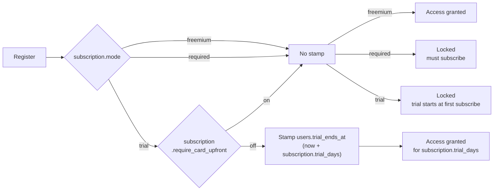
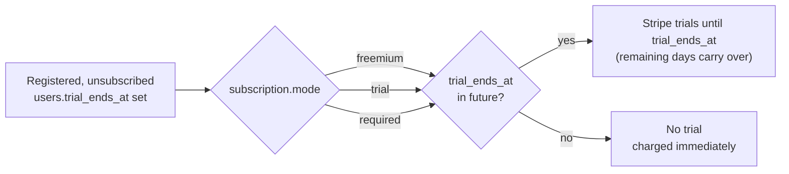
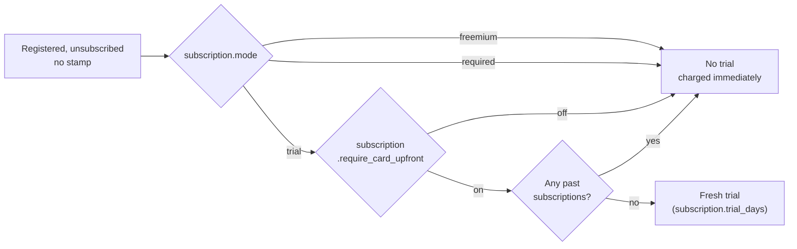
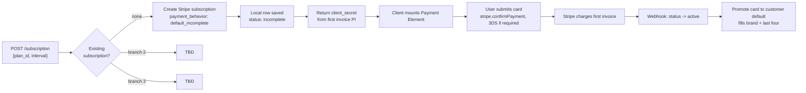
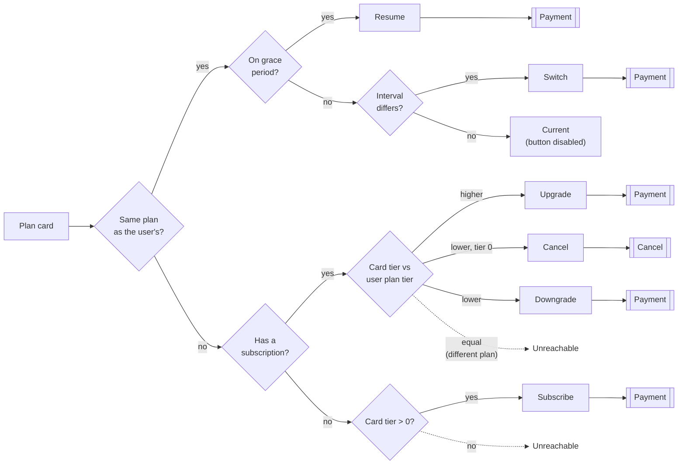
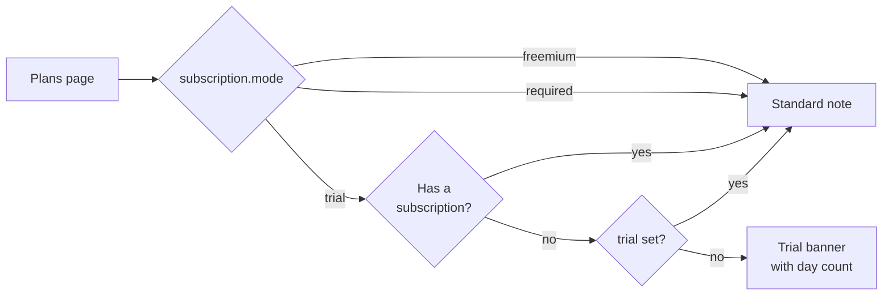

# Subscription Flows

The subscription mode can change at any time, so these flows are drawn as chunks rather than one path from registration to a live subscription. Each chunk starts from a state the user is already in, reads the mode fresh, and ends. Nothing carries between them, which is what makes the whole thing survivable in production.

Existing users are grandfathered in. A stamped trial stays stamped, an active subscription keeps running, and no script or migration is needed to flip a mode. The tradeoff is that a handful of users registering around the change may end up with a few free days they would not otherwise have got. That is fine, take it and move on.

## Registration

No plan is assigned at registration in any mode. The `plan` relation falls back to the free plan, so every path below lands on it, freemium is just the only mode where the gate lets you use it.

## Subscribe with a Stamp

The mode drops out entirely here, all three converge. A stamped date is the only thing that decides the outcome, so switching modes never takes a trial away from someone who already has one.

## Subscribe without a Stamp

The past subscriptions check is what stops a user farming trials by cancelling and resubscribing.

## New Subscription (Stripe)

A new subscritpion can be created on a fresh account and also other scenarios, like a cancel with grace period finished. The idea is to be gated in any scenario where there is some viable subscription even if it's in some past_due or unpaid status. Regardless assuming a new subscription creation allowed they will all follow this flow.

## Plan Selection

The plan cards resolve their own button label from the user's state, and the mode never enters into it. Mode decides what state the user turns up in, whether they hold a plan at all and whether the free plan is even in the list, and from there the resolution is the same everywhere. Worth knowing when reading the client, because the mode checks you would expect to find in the resolver are not there.

Identity comes from the plan id and direction comes from the tier. Moving between monthly and yearly on the same plan is a billing change rather than a tier move, so it gets its own action instead of being folded into an upgrade.

The subscription check sits ahead of the tier comparison on purpose. It catches the freemium user sitting on the free plan and the required-mode user carrying no plan at all in one branch, neither of whom has ever paid, so neither should be told they are upgrading. Upgrade then only ever means moving between two paid plans.

Having a subscription implies a paid tier, so the right-hand branch never sees a free user. Both dead ends need two plans sharing a tier, which nothing in the product creates but the schema does not forbid either. The resolver returns `select` there rather than guessing at a direction, which is why the branches stay in the code.

### Trial banner

The trial pitch above the cards is the only place the mode is read on this page. A trial is offered once, and the trial object stays set after it ends, so its absence is what marks a user as never having taken one.

