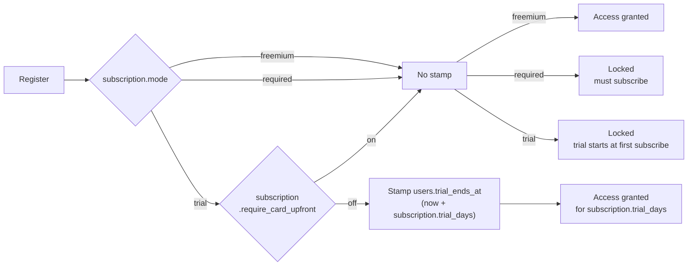
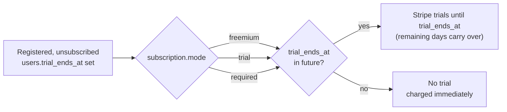
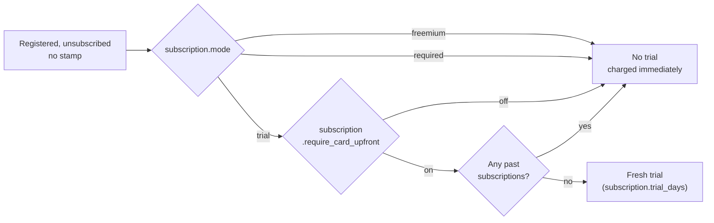

# Subscription Flows

The subscription mode can change at any time, so these flows are drawn as chunks rather than one path from registration to a live subscription. Each chunk starts from a state the user is already in, reads the mode fresh, and ends. Nothing carries between them, which is what makes the whole thing survivable in production.

Existing users are grandfathered in. A stamped trial stays stamped, an active subscription keeps running, and no script or migration is needed to flip a mode. The tradeoff is that a handful of users registering around the change may end up with a few free days they would not otherwise have got. That is fine, take it and move on.

## Registration

No plan is assigned at registration in any mode. The `plan` relation falls back to the free plan, so every path below lands on it, freemium is just the only mode where the gate lets you use it.

## Subscribe with a Stamp

The mode drops out entirely here, all three converge. A stamped date is the only thing that decides the outcome, so switching modes never takes a trial away from someone who already has one.

## Subscribe without a Stamp

The past subscriptions check is what stops a user farming trials by cancelling and resubscribing.

